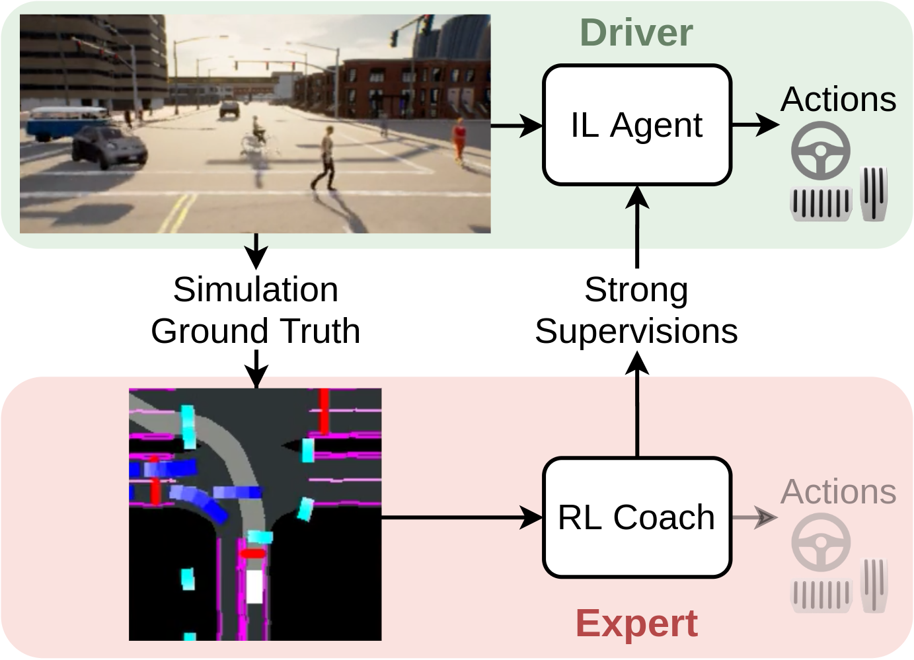

# CARLA-Roach

<p align="center">
  
</p>

<!--  -->

This is the official code release of the paper <br> 
**[End-to-End Urban Driving by Imitating a Reinforcement Learning Coach](https://arxiv.org/abs/2108.08265)** <br>
*by [Zhejun Zhang](https://www.trace.ethz.ch/team/members/zhejun.html), [Alexander Liniger](https://www.trace.ethz.ch/team/members/alex.html), [Dengxin Dai](https://www.trace.ethz.ch/team/members/dengxin.html), [Fisher Yu](https://www.yf.io/) and [Luc van Gool](https://www.trace.ethz.ch/team/members/luc.html)*, accepted at [ICCV 2021](http://iccv2021.thecvf.com). <br>

It contains the code for [benchmark](#benchmark), [off-policy data collection](#collect-off-policy-datasets), [on-policy data collection](#collect-on-policy-datasets), [RL training](#train-rl-experts) and [IL training with DAGGER](#train-il-agents).
It also contains [trained models](#trained-models) of RL experts and IL agents.
The supplementary videos can be found at the paper's [homepage](https://www.trace.ethz.ch/publications/2021/roach/index.html).

## The Offline Leaderboard

The "Leaderboard" we evaluated on is an offline version of the [CARLA Leaderboard](https://leaderboard.carla.org/). As further detailed in the [paper](https://arxiv.org/pdf/2108.08265.pdf), the offline Leaderboard has the following setup
- Map and routes: train/test split following Leaderboard [public routes](https://github.com/carla-simulator/leaderboard/tree/master/data).
- Metrics: following Leaderboard evaluation and metrics.
- Weather: train/test split following NoCrash.
- Background traffic: following NoCrash

One can use the offline Leaderboard if a thorough study on the generalization ability of the method is desired.

### Pros and Cons of the [**Online** Leaderboard](https://leaderboard.carla.org/leaderboard/):

(+) All methods are evaluated under exactly the same condition.

(+) No need to re-evaluate other methods.

(-) No restriction on how the method is trained and how the training data is collected. 

### Pros and Cons of the **Offline** Leaderboard:
(+) Strictly prescribes both the training and testing environment.

(+) Full control and observation over the benchmark.

(-) You will have to re-evaluate other methods, if any setup of the benchmark has changed, for example CARLA version and etc.


## Installation
Please refer to [INSTALL.md](doc/INSTALL.md) for installation. 
We use AWS EC2, but you can also install and run all experiments on your computer or cluster. 

## Quick Start: Collect an expert dataset using Roach

Roach is an end-to-end trained agent that drives better and more naturally than hand-crafted CARLA experts.
To collect a dataset from Roach, use [run/data_collect_bc.sh](run/data_collect_bc.sh) and modify the following arguments:
- `save_to_wandb`: set to `False` if you don't want to upload the dataset to W&B.
- `dataset_root`: local directory for saving the dataset.
- `test_suites`: default is `eu_data` which collects data in Town01 for the NoCrash-dense benchmark. Available configurations are found [here](config/test_suites). You can also create your own configuration.
- `n_episodes`: how many episodes to collect, each episode will be saved to a separate h5 file.
- `agent/cilrs/obs_configs`: observation (i.e. sensor) configuration, default is `central_rgb_wide`. Available configurations are found [here](config/agent/cilrs/obs_configs). You can also create your own configuration.
- `inject_noise`: default is `True`. As introduced in CILRS, triangular noise is injected to steering and throttle such that the ego-vehicle does not always follow the lane center. Very useful for imitation learning.
- `actors.hero.terminal.kwargs.max_time`: Maximum duration of an episode, in seconds.
- Early stop the episode if traffic rule is violated, such that the collected dataset is error-free.
  - `actors.hero.terminal.kwargs.no_collision`: default is `True`.
  - `actors.hero.terminal.kwargs.no_run_rl`: default is `False`.
  - `actors.hero.terminal.kwargs.no_run_stop`: default is `False`. 

## Benchmark

To benchmark checkpoints, use `run/benchmark.sh` and modify the arguments to select different settings. 
We recommend `g4dn.xlarge` with 50 GB free disk space for video recording.
Use `screen` if you want to run it in the background
```
screen -L -Logfile ~/screen.log -d -m run/benchmark.sh
```

### Trained Models

The trained models are hosted [here](https://wandb.ai/iccv21-roach/trained-models) on W&B.
Given the corresponding W&B run path, our code will automatically download and load the [checkpoint](https://wandb.ai/iccv21-roach/trained-models/runs/1929isj0/files/ckpt) with the [configuration yaml file](https://wandb.ai/iccv21-roach/trained-models/runs/1929isj0/files/config_agent.yaml).

The following checkpoints are used to produce the results reported in our paper.
- To benchmark the Autopilot, use `benchmark()` with `agent="roaming"`.
- To benchmark the RL experts, use `benchmark()` with `agent="ppo"` and set `agent.ppo.wb_run_path` to one of the following.
  - `iccv21-roach/trained-models/1929isj0`: Roach
  - `iccv21-roach/trained-models/1ch63m76`: PPO+beta
  - `iccv21-roach/trained-models/10pscpih`: PPO+exp
- To benchmark the IL agents, use `benchmark()` with `agent="cilrs"` and set `agent.cilrs.wb_run_path` to one of the following.
  - Checkpoints trained for the NoCrash benchmark, at DAGGER iteration 5:
    - `iccv21-roach/trained-models/39o1h862`: L_A(AP)
    - `iccv21-roach/trained-models/v5kqxe3i`: L_A
    - `iccv21-roach/trained-models/t3x557tv`: L_K
    - `iccv21-roach/trained-models/1w888p5d`: L_K+L_V
    - `iccv21-roach/trained-models/2tfhqohp`: L_K+L_F
    - `iccv21-roach/trained-models/3vudxj38`: L_K+L_V+L_F
    - `iccv21-roach/trained-models/31u9tki7`: L_K+L_F(c)
    - `iccv21-roach/trained-models/aovrm1fs`: L_K+L_V+L_F(c)
  - Checkpoints trained for the LeaderBoard benchmark, at DAGGER iteration 5:
    - `iccv21-roach/trained-models/1myvm4mw`: L_A(AP)
    - `iccv21-roach/trained-models/nw226h5h`: L_A
    - `iccv21-roach/trained-models/12uzu2lu`: L_K
    - `iccv21-roach/trained-models/3ar2gyqw`: L_K+L_V
    - `iccv21-roach/trained-models/9rcwt5fh`: L_K+L_F
    - `iccv21-roach/trained-models/2qq2rmr1`: L_K+L_V+L_F
    - `iccv21-roach/trained-models/zwadqx9z`: L_K+L_F(c)
    - `iccv21-roach/trained-models/21trg553`: L_K+L_V+L_F(c)

### Available Test Suites
Set argument `test_suites` to one of the following.
- NoCrash-busy
  - `eu_test_tt`: NoCrash, busy traffic, train town & train weather
  - `eu_test_tn`: NoCrash, busy traffic, train town & new weather
  - `eu_test_nt`: NoCrash, busy traffic, new town & train weather
  - `eu_test_nn`: NoCrash, busy traffic, new town & new weather
  - `eu_test`: eu_test_tt/tn/nt/nn, all 4 conditions in one file
- NoCrash-dense
  - `nocrash_dense`: NoCrash, dense traffic, all 4 conditions
- LeaderBoard:
  - `lb_test_tt`: LeaderBoard, busy traffic, train town & train weather
  - `lb_test_tn`: LeaderBoard, busy traffic, train town & new weather
  - `lb_test_nt`: LeaderBoard, busy traffic, new town & train weather
  - `lb_test_nn`: LeaderBoard, busy traffic, new town & new weather
  - `lb_test`: lb_test_tt/tn/nt/nn all, 4 conditions in one file
- LeaderBoard-all
  - `cc_test`: LeaderBoard, busy traffic, all 76 routes, dynamic weather


## Collect Datasets

We recommend `g4dn.xlarge` for dataset collecting. Make sure you have enough disk space attached to the instance.

### Collect Off-Policy Datasets

To collect off-policy datasets, use `run/data_collect_bc.sh` and modify the arguments to select different settings.
You can use Roach (given a checkpoint) or the Autopilot to collect off-policy datasets.
In our paper, before the DAGGER training the IL agents are initialized via behavior cloning (BC) using an off-policy dataset collected in this way.

Some arguments you may want to modify:
- Set `save_to_wandb=False` if you don't want to upload the dataset to W&B.
- Select the environment for collecting data by setting the argument `test_suites` to one of the following
  - `eu_data`: NoCrash, train town & train weather. We collect `n_episodes=80` for BC dataset on NoCrash, that is around 75 GB and 6 hours of data.
  - `lb_data`: LeaderBoard, train town & train weather. We collect `n_episodes=160` for BC dataset on LeaderBoard, that is around 150 GB and 12 hours of data.
  - `cc_data`: CARLA Challenge, all six maps (Town1-6), dynamic weather. We collect `n_episodes=240` for BC dataset on CARLA Challenge, that is around 150 GB and 18 hours of data.
- For RL experts, the used checkpoint is set via `agent.ppo.wb_run_path` and `agent.ppo.wb_ckpt_step`. 
  - `agent.ppo.wb_run_path` is the W&B run path where the RL training is logged and the checkpoints are saved. 
  - `agent.ppo.wb_ckpt_step` is the step of the checkpoint you want to use. If it's an integer, the script will find the checkpoint closest to that step. If it's null, the latest checkpoint will be used.


### Collect On-Policy Datasets

To collect on-policy datasets, use `run/data_collect_dagger.sh` and modify the arguments to select different settings.
You can use Roach or the Autopilot to label on-policy (DAGGER) datasets generated by an IL agent (given a checkpoint).
This is done by running the `data_collect.py` using an IL agent as the driver, and Roach/Autopilot as the coach.
So the expert supervisions are generated and recorded on the fly.

Most things are the same as collecting off-policy BC datasets. Here are some changes:
- Set `agent.cilrs.wb_run_path` to the W&B run path where the IL training is logged and the checkpoints are saved. 
- By adjusting `n_episodes` we make sure the size of the DAGGER dataset at each iteration to be around 20% of the BC dataset size.
  - For RL experts we use an `n_episodes` which is the half of `n_episodes` of the BC dataset.
  - For the Autopilot we use an `n_episodes` which is the same as `n_episodes` of the BC dataset.


## Train RL Experts

To train RL experts, use `run/train_rl.sh` and modify the arguments to select different settings.
We recommend to use `g4dn.4xlarge` for training the RL experts, you will need around 50 GB free disk space for videos and checkpoints.
We train RL experts on CARLA 0.9.10.1 because 0.9.11 crashes more often for unknown reasons. 

## Train IL Agents

To train IL agents, use `run/train_il.sh` and modify the arguments to select different settings.
Training IL agents does not require CARLA and it's a GPU-heavy task. Therefore, we recommend to use AWS p-instances or your cluster to run the IL training.
Our implementation follows DA-RB ([paper](https://openaccess.thecvf.com/content_CVPR_2020/html/Prakash_Exploring_Data_Aggregation_in_Policy_Learning_for_Vision-Based_Urban_Autonomous_CVPR_2020_paper.html), [repo](https://github.com/autonomousvision/data_aggregation)), which trains a CILRS ([paper](https://openaccess.thecvf.com/content_ICCV_2019/html/Codevilla_Exploring_the_Limitations_of_Behavior_Cloning_for_Autonomous_Driving_ICCV_2019_paper.html), [repo](https://github.com/felipecode/coiltraine)) agent using [DAGGER](https://arxiv.org/abs/1011.0686). 

The training starts with training the basic CILRS via behavior cloning using an off-policy dataset.
1. Collect off-policy DAGGER dataset.
2. Train the IL model.
3. Benchmark the trained model.

Then repeat the following DAGGER steps until the model achieves decent results.
1. Collect on-policy DAGGER dataset.
2. Train the IL model.
3. Benchmark the trained model.

For the BC training,the following arguments have to be set.
- Datasets
  - `dagger_datasets`: a vector of strings, for BC training it should only contain the path (local or W&B) to the BC dataset.
- Measurement vector
  - `agent.cilrs.env_wrapper.kwargs.input_states` can be a subset of `[speed,vec,cmd]`
  - `speed`: scalar ego_vehicle speed
  - `vec`: 2D vector pointing to the next GNSS waypoint
  - `cmd`: one-hot vector of high-level command
- Branching
  - For 6 branches:
    - `agent.cilrs.policy.kwargs.number_of_branches=6`
    - `agent.cilrs.training.kwargs.branch_weights=[1.0,1.0,1.0,1.0,1.0,1.0]`
  - For 1 branch:
    - `agent.cilrs.policy.kwargs.number_of_branches=1`
    - `agent.cilrs.training.kwargs.branch_weights=[1.0]`
- Action Loss
  - L1 action loss
    - `agent.cilrs.env_wrapper.kwargs.action_distribution=null`
    - `agent.cilrs.training.kwargs.action_kl=false`
  - KL loss
    - `agent.cilrs.env_wrapper.kwargs.action_distribution="beta_shared"`
    - `agent.cilrs.training.kwargs.action_kl=true`
- Value Loss
  - Disable
    - `agent.cilrs.env_wrapper.kwargs.value_as_supervision=false`
    - `agent.cilrs.training.kwargs.value_weight=0.0`
  - Enable
    - `agent.cilrs.env_wrapper.kwargs.value_as_supervision=true`
    - `agent.cilrs.training.kwargs.value_weight=0.001`
- Pre-trained action/value head
    - `agent.cilrs.rl_run_path` and `agent.cilrs.rl_ckpt_step` are used to initialize the IL agent's action/value heads with Roach's action/value head.
- Feature Loss
  - Disable
    - `agent.cilrs.env_wrapper.kwargs.dim_features_supervision=0`
    - `agent.cilrs.training.kwargs.features_weight=0.0`
  - Enable
    - `agent.cilrs.env_wrapper.kwargs.dim_features_supervision=256`
    - `agent.cilrs.training.kwargs.features_weight=0.05`

During the DAGGER training, a trained IL agent will be loaded and you cannot change the configuration any more. You will have to set
- `agent.cilrs.wb_run_path`: the W&B run path where the previous IL training was logged and the checkpoints are saved.
- `agent.cilrs.wb_ckpt_step`: the step of the checkpoint you want to use. Leave it as `null` will load the latest checkpoint.
- `dagger_datasets`: vector of strings, W&B run path or local path to DAGGER datasets and the BC dataset in time-reversed order, for example `[PATH_DAGGER_DATA_2, PATH_DAGGER_DATA_1, PATH_DAGGER_DATA_0, BC_DATA]`
- `train_epochs`: optionally you can change it if you want to train for more epochs.


## Citation
Please cite our work if you found it useful:
```
@inproceedings{zhang2021roach,
  title = {End-to-End Urban Driving by Imitating a Reinforcement Learning Coach},
  booktitle = {Proceedings of the IEEE/CVF International Conference on Computer Vision (ICCV)},
  author = {Zhang, Zhejun and Liniger, Alexander and Dai, Dengxin and Yu, Fisher and Van Gool, Luc},
  year = {2021},
}
```

## License
This software is released under a CC-BY-NC 4.0 license, which allows personal and research use only. For a commercial 
license, please contact the authors. You can view a license summary here.

Portions of source code taken from external sources are annotated with links to original files and their corresponding 
licenses.

## Acknowledgements
This work was supported by Toyota Motor Europe and was carried out at the TRACE Lab at ETH Zurich (Toyota Research on 
Automated Cars in Europe - Zurich).
